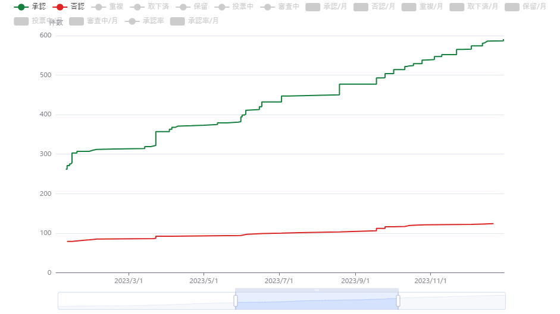
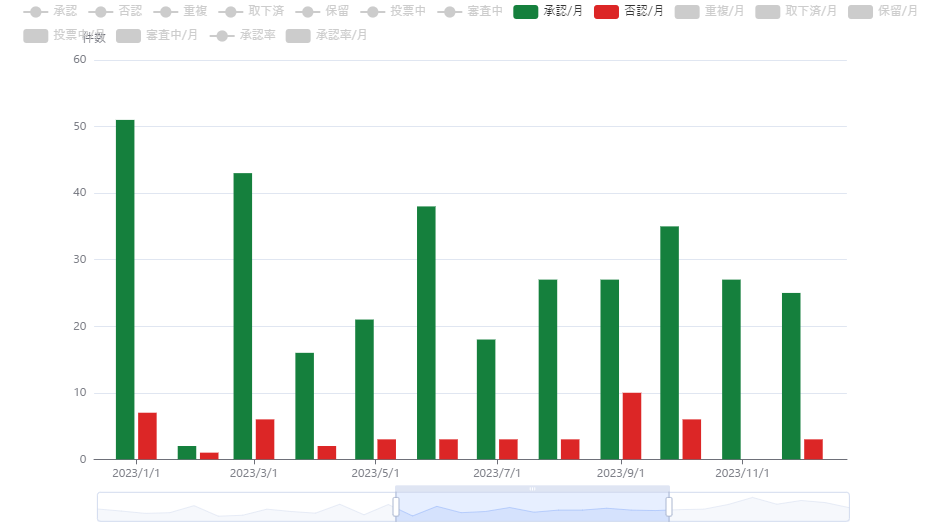
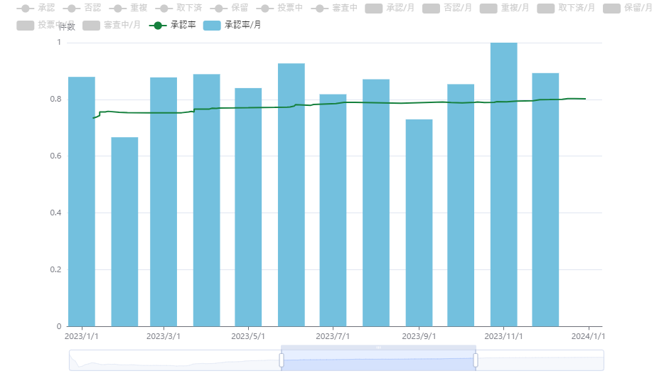

# wayfarer-statistics-charts





## 使い方

[インストール](../../raw/main/wayfarer-statistics-charts.user.js)

// TODO: 操作説明

---

## 開発者向け

### 環境

[npm](https://nodejs.org/ja/) が必要。

### ビルド

以下のコマンドを実行する。

```shell
npm install
npm run build
```

### デバッグ

#### 準備

1. Chrome に [Tampermonkey](https://chrome.google.com/webstore/detail/tampermonkey/dhdgffkkebhmkfjojejmpbldmpobfkfo) をインストールする。
1. 拡張機能 → Tampermonkey → ファイルの URL へのアクセスを許可する に ☑。
1. [デバッグ用ファイル](../../raw/main/wrapper_script_in_tampermonkey.user.js) を Tampermonkey にインストール。
1. Tampermonkey の設定からデバッグ用ファイルを開いて `<ユーザー名>` を自分のユーザー名に置き換えて保存。

#### 開始

1. 以下のコマンドを実行する。

    ```shell
    npm install
    npm run debug
    ```

1. Chrome で対象ページを開く。

1. 好みのエディタでソースコードを編集する。

- *.user.js は自動生成ファイルなのでいじらない。
- ソースコードを変更したらページを手動で再読み込みする。
  // TODO: オートリロード対応

#### 後始末

- コマンドを走らせているコンソールを閉じる。
- Tampermonkey からデバッグ用ファイルを削除する。
- 拡張機能 → Tampermonkey → ファイルの URL へのアクセスを許可する の ☑ を元に戻す。
